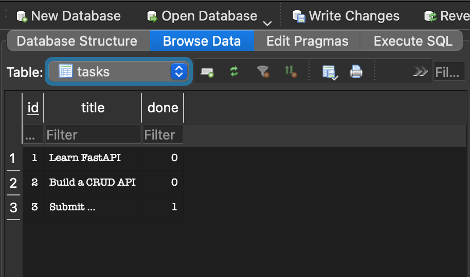

# CRUD Task API

A simple REST API for managing tasks built with **FastAPI** and **SQLite**.

## Features

- ✅ Full CRUD operations (Create, Read, Update, Delete)
- ✅ SQLite database (data survives restarts!)
- ✅ Automatic database creation and seeding
- ✅ Input validation with proper status codes
- ✅ Interactive API docs at `/docs`

## Endpoints

| Method | Endpoint | Description |
|--------|----------|-------------|
| GET | `/` | Hello message |
| GET | `/root` | API information |
| GET | `/health` | Health check |
| GET | `/tasks` | List all tasks |
| GET | `/tasks/{id}` | Get one task |
| POST | `/tasks` | Create a task |
| PUT | `/tasks/{id}` | Update a task |
| DELETE | `/tasks/{id}` | Delete a task |

## How to Run

```bash
# Clone the repo
git clone https://github.com/FurqanArshad0/crud-api.git
cd crud-api

# Create virtual environment
python -m venv venv
source venv/bin/activate  # On Windows: venv\Scripts\activate

# Install dependencies
pip install fastapi uvicorn

# Run the server
python3 app.py
```

## API Documentation

Visit `http://localhost:8001/docs` for Swagger UI.

## Database

This project uses **SQLite** for persistence.

- **File:** `tasks.db` (created automatically)
- **Table:** `tasks` with columns `id`, `title`, `done`
- **Why SQLite?** No server setup, single file, survives restarts

### Database Screenshot



## Example Requests

### Create a task
```bash
curl -X POST http://localhost:8001/tasks \
  -H "Content-Type: application/json" \
  -d '{"title": "Buy milk"}'
```

### List all tasks
```bash
curl http://localhost:8001/tasks
```

## Technologies

- Python 3.10+
- FastAPI
- SQLite
- Uvicorn

## Assignment

Built for **FlyRank Backend AI Engineering Internship - Assignment 2**

**Before (A1):** In-memory storage ❌ (data lost on restart)  
**After (A2):** SQLite database ✅ (data survives restarts)